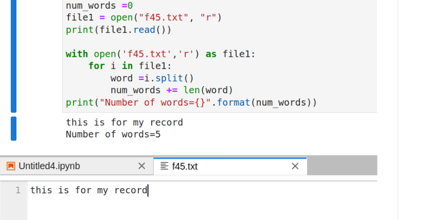

# Word-count
## AIM:
To write a python program for getting the word count from a text.
## EQUIPEMENT'S REQUIRED: 
PC
Anaconda - Python 3.7
## ALGORITHM: 
### Step 1:
Open the file in read mode and handle it in test mood.

### Step 2: 
Read the text using read() function.
 
### Step 3:
Split the text using space separator.We assume that words in a sentance are
separted by a space character

### Step 4:
The length of the split list should equal the numbers of words in the test file.

### Step 5: 
The length of the split list should equal the numbers of words in the test file.

### Step 6: 
End the program.

## PROGRAM:
```python
num_words =0
file1 = open("text.txt", "r")
print(file1.read())
with open('text.txt','r') as file1:
for i in file1:
word =i.split()
num_words += len(word)
print("Number of words={}".format(num_words))
```
### OUTPUT:



## RESULT:
Thus the program is written to find the word count from a text.
